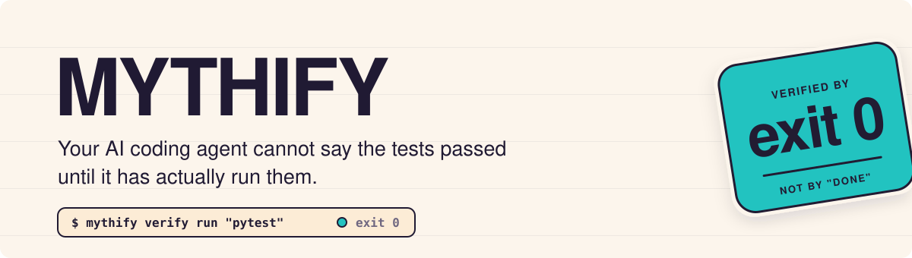
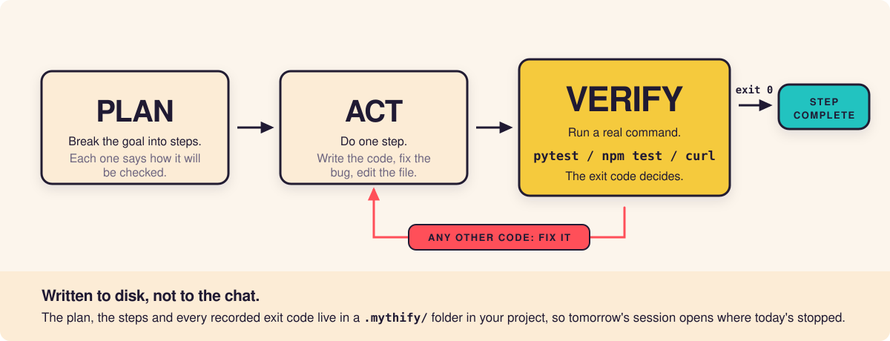

<p align="center">
  
</p>

<p align="center">
  <a href="https://github.com/hannsxpeter/mythify/actions/workflows/ci.yml"></a>
  <a href="https://github.com/hannsxpeter/mythify/releases/latest"></a>
  
  
  <a href="LICENSE"></a>
</p>

## Your AI just said "done." Did it check?

Ask an AI coding assistant to fix a bug and you will usually get a confident
reply: *"Fixed. All tests pass."*

Quite often, no test was run. The agent read the code, decided the change looked
right, and told you what it believed. Sometimes that belief is correct.
Sometimes it is not. From the message alone, you cannot tell which.

**Mythify closes that gap.** It sits between the agent and the claim. Before any
piece of work can be marked finished, the agent has to run a real command and
show you what came back. It passed, or it did not. Nobody's opinion is involved.

Mythify does not make the model smarter. It makes it accountable.

## How it works

<p align="center">
  
</p>

That is the whole idea. Everything else in this repository is convenience built
around that loop.

## Is this for you?

**You use an AI coding assistant** and you have been burned by a "done" that was
not done. Mythify turns that claim into something you can check at a glance.

**You are shipping software without being an engineer yourself.** A lot of
people now build real things with AI and no team to review the output. Mythify
gives you a second opinion that cannot be talked out of its position, because it
is not an opinion. It is an exit code.

**You manage people who build with AI.** Mythify leaves a written trail on disk:
what the goal was, what was attempted, what was actually checked, and what is
still unproven. You can read it without reading any code.

**You run long or multi-session work.** Chats forget. Mythify writes the plan,
the decisions, and the evidence into a folder in your project, so tomorrow's
session opens exactly where today's stopped.

## What you actually get

**A refusal you can rely on.** Try to mark a task complete with nothing but a
sentence and Mythify says no. That refusal is the product.

**A record anyone can read.** Every check, every exit code, every reversal is
written down in plain files. Nothing important lives only in the chat scrollback.

**Memory that survives the session.** Facts, decisions, and hard-won lessons are
stored on disk and read back at the start of the next session.

**A leash on autonomy.** When you do want the agent to keep working on its own,
you give it a finish line, a budget, and a fence. It stops at the first one it
hits.

## Get started in five minutes

Mythify needs Python 3.9 or newer. Node 20+ is optional and only used for the
server that plugs Mythify directly into agent tooling.

```bash
git clone https://github.com/hannsxpeter/mythify.git
cd mythify
./scripts/install_user.sh --project /path/to/your/project
```

There is no account to create, no API key, and no `npm install`. Mythify is
zero-dependency Python plus one small optional Node server. The installer copies
a self-contained runtime into your home directory, so you can delete the clone
afterwards and everything keeps working.

Now run your first loop from inside your own project:

```bash
mythify init                       # create the .mythify/ folder (once per project)

# Describe the work, and how you will know it is finished:
mythify plan create "Fix the failing parser test" \
  --steps '[{"title":"Reproduce and fix","success_criteria":"parser tests pass","verify_command":"python3 -m unittest discover -s tests"}]'

mythify step 1 in_progress          # start
# ... you, or your agent, do the actual work ...

mythify plan verify 1               # Mythify runs the check for you
mythify step 1 completed "verify run exit 0: parser tests pass"
```

That last line only succeeds because a real check passed first. Without it,
Mythify refuses.

Three commands cover most days:

```bash
mythify status      # where am I, what is next
mythify report      # a plain-language play-by-play of recent progress
mythify summary     # the whole session: plans, evidence, lessons
```

Prefer not to install anything? Run it straight from the clone with
`python3 scripts/mythify.py ...` inside your project.

### Other ways to install

<details>
<summary>Standalone CLI archive, no clone required</summary>

Download `mythify-cli-VERSION.tar.gz` from a
[release](https://github.com/hannsxpeter/mythify/releases/latest), then:

```bash
tar -xzf mythify-cli-VERSION.tar.gz
./mythify-cli-VERSION/scripts/install_user.sh \
  --skip-mcp \
  --project /path/to/your/project
```

To build that same archive from a source clone, run
`python3 scripts/package_cli.py`. The archive holds the Python runtime, protocol
manifests, chat skills, and its own installer. Its contents and gzip metadata
are deterministic, so the same source tree always produces the same bytes.

</details>

<details>
<summary>Agent tooling support (MCP server)</summary>

Releases also ship `mythify-mcp-VERSION.tgz`. Create a small runtime directory,
run `npm install /path/to/mythify-mcp-VERSION.tgz` there, and point your MCP
client at `node node_modules/mythify-mcp/src/index.js` with `MYTHIFY_DIR` set to
your project's `.mythify` directory. This is a local tarball install; Mythify is
not published to an npm registry.

</details>

<details>
<summary>Uninstalling</summary>

```bash
mythify-uninstall
```

This removes the launchers, the versioned runtime, the chat skills, and the
optional hook that installation selected. It leaves alone anything it did not
install, other installed versions, and every project's `.mythify` folder. An
ownership manifest binds installed files by content hash, so if that evidence is
missing or has changed, uninstall stops without deleting anything.

</details>

## The pieces, one at a time

You do not need all of these on day one. Reach for them as the work gets bigger.

### Plans and steps

A **plan** is a goal plus ordered **steps**. Each step can carry a
`verify_command`: the exact command that proves it is done. `plan verify ID` runs
that command and files the result against the step, which is what lets
`step ID completed` succeed. "Definition of done is a check you can run" made
literal.

### Verification: proof, not promises

- `verify run "COMMAND"` runs a command and records the exit code as evidence.
- `verify claim "..."` records a plain-English claim when genuinely nothing is
  runnable. It is permanently marked second-class and never counts as proof.

Completing a step requires a real `verify run` that exited 0 after the step
started. If the step stores a `verify_command`, the recorded command has to match
it. `MYTHIFY_REQUIRE_VERIFIED_STEP=0` restores the old prose-only behavior, and you should
only reach for it knowing exactly what you are giving up.

### Memory and lessons

`memory set` and `memory get` hold facts, decisions, and discoveries.
`lesson add` records something learned the hard way. Both live on disk, so a
fresh session starts informed instead of blank.

### Routing: "what should I even do here?"

`mythify route "your task"` reads your request alongside your current state and
recommends the next move: just answer it, make a plan, start a loop, run a
review. It advises only. It never acts on its own.

`mythify loop-fit "your task"` answers a narrower question: should this run
hands-off, run supervised, or just get done by hand? It checks five things.
Is there a real pass or fail check? Does the work repeat? Is there a repository
to work in? Does it need human taste? Is it an open-ended quality climb toward
a reference, like "as good as Linear"? Work with no objective check is never a
hands-off loop. A quality climb gets its own shape instead: builders fan out,
one separate harsh critic judges the result blind against the reference, and
you state the budget up front, because the bar never says done and you are the
brake.

## Autonomous loops

Sometimes you want the agent to keep trying on its own until a check passes.
Mythify allows that, on a leash:

```bash
mythify outcome start "make the suite green" \
  --success "all tests pass" \
  --verify "python3 -m unittest discover -s tests" \
  --agent "your-agent-cli --do-the-work" \
  --max-iterations 5 \
  --max-cost 100 \
  --escalate-after 3 \
  --allowed-paths "src,tests"

mythify outcome run                 # drives the loop by itself
```

Each round fires your `--agent` command, runs the verifier, records the evidence,
and repeats. It stops at whichever of these comes first:

| Stop condition | What happened |
| :--- | :--- |
| Success | The verifier passed. |
| Iteration budget | It reached `--max-iterations`. |
| Cost budget | Cumulative cost hit `--max-cost`. Your agent reports cost with a `MYTHIFY_COST=<n>` line; otherwise each round counts as one. |
| Scope violation | The agent touched files outside `--allowed-paths`. Enforced through git, not on trust. |
| Escalation | It failed the verifier `--escalate-after` times in a row and handed the problem back to you. |

The loop cannot declare success without the verifier, and it cannot run
unbounded.

## Wayfinding: deciding before planning

Some work is too big for one session and the route to the finish is not visible
yet. A plan is the wrong tool, because you cannot write steps for decisions you
have not made. Mythify's **map** holds those decisions instead:

```bash
mythify map create "Ship a billing revamp spec" \
  --fog "how do existing subscriptions migrate"

mythify map ticket "Pick the proration model" --type grilling
mythify map ticket "Confirm the gateway supports partial refunds" --type research
mythify map ticket "Provision a sandbox account" --type task \
  --verify "curl -sf https://sandbox.example/health" --blocked-by T2

mythify map show          # destination, decisions so far, frontier, fog, out of scope
```

A ticket is a **question**, not a slice of the build. Its type decides who is
allowed to answer it, and Mythify enforces that:

| Type | Who answers | To close it |
| :--- | :--- | :--- |
| `research` | the agent alone | an answer; these run in parallel |
| `task` | the agent alone | an answer, plus a passing `map verify` if it stores a check |
| `grilling` | a human | an answer **and** `--human-input` recording what the human decided |
| `prototype` | a human reacting to something rough | the same |

That last rule is the evidence rule applied to decisions. An agent that answers
its own question has proved nothing, exactly like an agent that says the tests
pass without running them. `mythify map resolve T1 --answer "..."` on a
`grilling` ticket is **refused** until a real person has weighed in.

Everything else follows from that:

- **Claim before you work.** One decision ticket at a time, so parallel sessions
  cannot collide. Research is exempt.
- **Fog is first class.** What you cannot yet state sharply goes into
  `Not yet specified` and graduates into a ticket once it is sharp.
- **Out of scope is recorded, not forgotten.** Work ruled past the destination is
  closed with a reason and never creeps back.
- **The map ends where the plan begins.** When no ticket and no fog remain,
  `mythify map promote` creates a plan whose goal is the destination and whose
  provenance carries every decision and boundary you settled.

`mythify route "I have a loose idea and need to work out what we decide first"`
picks this route on its own, and `mythify prompt map` renders the whole map plus
its rules for a fresh session.

The design is adapted from Matt Pocock's
[wayfinder skill](https://github.com/mattpocock/skills/blob/main/skills/engineering/wayfinder/SKILL.md),
with Mythify's evidence gates layered on top.

## Working from existing plans and audits

If you use [godplans](https://github.com/hannsxpeter/godplans) or
[godaudits](https://github.com/hannsxpeter/godaudits), Mythify reads their
`.godplans/PLAN.mdx` and `.godaudits/AUDIT.mdx` files directly:

```bash
mythify plan import --source godplans
```

Each imported task keeps its exact verify command, so executing the plan is the
same verify-gated loop as everything else. Mythify never edits those files. It
reads them and holds the evidence trail.

## Running several agents at once

The optional Node MCP server exposes Mythify's state to agent tooling and adds
**fanout**: several independent agent tasks running in parallel. Writing tasks
can use `isolation: "worktree"` so each one gets its own git worktree on a fresh
branch and cannot collide with the others. You merge the branches you want.

The server shares the exact same `.mythify/` folder as the CLI, so a plan made in
one is visible in the other. It exposes Mythify through 50 MCP tools; the full
list is in [docs/design.md](docs/design.md).

Fanout results are material, not proof. Merge the work, then verify the merged
result the same way as anything else.

## Inspecting owned artifacts for watermark signals

Mythify can use
[`watermarks-remover`](https://github.com/guillaumemeyer/watermarks-remover)
through an optional external service. The integration probes service health and
capabilities, separates deterministic findings from heuristic advisory signals,
and can clean an owned or authorized artifact to a separate output file.

```bash
mythify artifact probe
mythify artifact inspect ./document.pdf
mythify artifact clean ./document.pdf \
  --output ./document.cleaned.pdf \
  --confirm-authorized
```

Loopback is the default trust boundary. Remote use needs explicit service and
data-upload acknowledgements. Cleaning refuses in-place and symbolic-link
outputs, inspects the returned bytes before writing atomically, and never counts
service output as Mythify verification evidence. See
[docs/artifact-hygiene.md](docs/artifact-hygiene.md) for the service contract,
false-positive policy, licensing boundaries, and residual risks.

## Feeling native in chat

Three chat skills make Mythify feel like a built-in command inside your agent:

- `/mythify-work` in Claude Code, or `$mythify-work` in Codex: a visible
  step-by-step work loop.
- `/mythify-route`: show the recommended next move.
- `/mythify-verify`: turn a claim into real evidence and report the verdict.

## Command reference

The everyday commands:

| Command | What it does |
| :--- | :--- |
| `init` | Create the `.mythify/` folder. Run once per project. |
| `route "TASK"` | Recommend the next workflow move. Read-only. |
| `map create DESTINATION` | Chart a decision map when the route is not visible yet. |
| `map ticket TITLE --type ...` | Add a decision ticket: research, prototype, grilling, or task. |
| `map claim ID` / `map resolve ID --answer ...` | Take one ticket, then close it with its decision. |
| `map promote` | Hand a settled map to a plan, decisions and scope included. |
| `plan create GOAL [--steps JSON]` | Create a plan. Steps may include `verify_command`. |
| `plan add-step TITLE [--verify CMD]` | Add a step, optionally with its check. |
| `plan verify ID` | Run a step's own check and record scoped evidence. |
| `plan import [--source godplans\|godaudits]` | Import a PLAN.mdx or AUDIT.mdx as a plan. |
| `step ID STATUS [RESULT]` | Update a step. `completed` needs a passing exit-0 verify matching any stored command. |
| `verify run "CMD" [--claim ...]` | Run a command and record the exit code as evidence. |
| `outcome start GOAL --success ... --verify ...` | Start a verifier-backed loop. Add `--agent` to self-drive. |
| `outcome run` | Drive a self-driving loop to success or a bounded stop. |
| `memory set/get`, `lesson add/list` | Persist facts, decisions, and lessons. |
| `artifact probe`, `artifact inspect`, `artifact clean` | Use the optional external artifact-hygiene adapter. Direct results are material, not verification evidence. |
| `status`, `report`, `summary` | Orient, narrate progress, and wrap up. |

There is more underneath: campaigns, research, dashboards, model policy, trace
analysis, and the full MCP tool set. The complete reference is in
[docs/design.md](docs/design.md), and a guided tour is in
[docs/start-here.md](docs/start-here.md).

## Choosing a model for the job

`classify` and `route` return a `model_policy.model_router`. It picks a
provider-neutral profile, `utility`, `balanced`, `strong`, or explicit-only
`max`, while keeping autonomy, topology, reasoning effort, independent review,
and executable verification as separate decisions.

OpenAI resolves these to Luna, Terra, Sol, and Sol in max or pro mode. Claude
resolves them to Haiku, Sonnet, Opus, and Fable. Cursor workers inspect their
live model catalog and pick a matching available model without crossing
providers.

Pass `--model-profile` to override the default for a task. Pass `--failure-count`
only from real verifier failures; escalation then moves one profile per failure
and stops at `strong`. The older `fast`, `standard`, and `frontier` inputs still
work as aliases.

A stronger model is still just a stronger opinion. Executable checks decide
completion.

For independently parallel research, design, migration, security, release, or
benchmark work, the router can recommend the native `claude-ultracode` adapter.
The MCP host launches exactly one Claude dynamic workflow through `fanout_start`,
watches it with `fanout_status`, and ingests its final material with
`fanout_results`. The adapter needs Claude Code 2.1.203 or newer, keeps
permissions with the host, and never promotes workflow output into evidence.

## Evidence, honestly

Mythify is a product about not overclaiming, so here is exactly what has been
measured and what has not.

A [reproducible Codex smoke comparison](docs/evidence/efficacy-reproduction.md)
ran two paired trials of one small Python bug fix. Bare and Mythify both passed
2 of 2 external verifiers. The Mythify condition additionally produced executed,
passing evidence for the expected verifier command.

That confirms the evidence mechanism works in that small run. It is **not** a
demonstrated improvement in task success or speed. The sample was tiny, the order
was fixed, the account default model was not pinned, and neither monetary cost
nor subscription quota was measured.

If someone shows you a bigger claim than that about this project, it did not come
from here.

## How it is built

Two runtimes over one state folder:

- **CLI** (`scripts/mythify.py` and friends): zero-dependency Python 3.9+.
- **MCP server** (`mcp-server/`): Node 20+, exposing the same state as MCP tools
  plus fanout.

Both read and write the same `.mythify/` directory. Shared manifests, semantic
contract checks, and interop tests keep the two independent implementations
aligned. The protocol text itself (`protocol/PROTOCOL.md`) is the source for the
drop-in rules files `CLAUDE.md`, `AGENTS.md`, and `.cursorrules`.

## Learn more

- [docs/start-here.md](docs/start-here.md): the shortest path to using Mythify.
- [docs/design.md](docs/design.md): the complete design and command reference.
- [docs/evidence/efficacy-reproduction.md](docs/evidence/efficacy-reproduction.md): the reproducible smoke run and its limits.
- [CHANGELOG.md](CHANGELOG.md): what changed in each release.
- [CONTRIBUTING.md](CONTRIBUTING.md): how to contribute.

## License

MIT. See [LICENSE](LICENSE).
