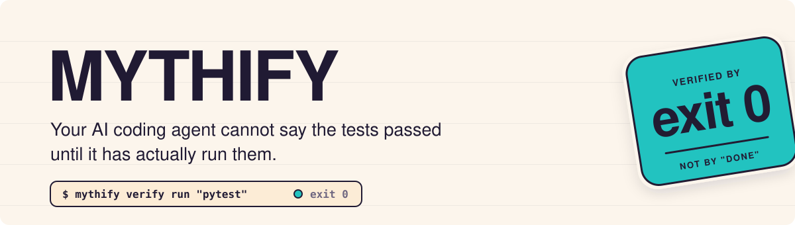
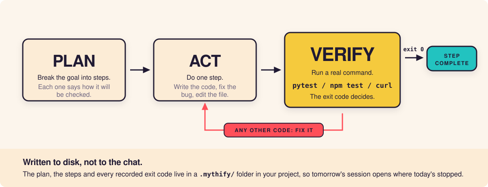

<p align="center">
  
</p>

<p align="center">
  <a href="https://github.com/hannsxpeter/mythify/actions/workflows/ci.yml"></a>
  <a href="https://github.com/hannsxpeter/mythify/releases/latest"></a>
  
  
  
  <a href="LICENSE"></a>
</p>

## Your AI just said "done." Did it check?

Ask an AI coding assistant to fix a bug and you will usually get a confident
reply: *"Fixed. All tests pass."*

Quite often, no test was run. The agent read the code, decided the change looked
right, and told you what it believed. Sometimes that belief is correct.
Sometimes it is not. From the message alone, you cannot tell which.

**Mythify closes that gap.** Before any piece of work can be marked finished,
the agent has to run a real command and record what came back. It passed, or it
did not. Nobody's opinion is involved.

Mythify does not make the model smarter. It makes it accountable, whichever
model you use.

## How it works

<p align="center">
  
</p>

That is the whole idea. Everything else in this repository is built around that
loop.

## Is this for you?

**You use an AI coding assistant** and you have been burned by a "done" that was
not done. Mythify turns that claim into something you can check at a glance.

**You are shipping software without being an engineer yourself.** Mythify gives
you a second opinion that cannot be talked out of its position, because it is
not an opinion. It is an exit code.

**You lead a product or a team that builds with AI.** Mythify keeps a written
trail on disk: why the work exists, who it is for, what outcome it should move,
what was attempted, what was actually checked, and what is still unproven. You
can read it without reading any code.

**You run long or multi-session work.** Chats forget. Mythify writes the plan,
the decisions, and the evidence into a folder in your project, so tomorrow's
session opens exactly where today's stopped.

## What you get

- **A refusal you can rely on.** Try to mark a step complete with nothing but a
  sentence and Mythify says no. That refusal is the product.
- **A record anyone can read.** Every check, exit code, and reversal is written
  to plain files in `.mythify/`.
- **Product plans with teeth.** Problem, user, measurable outcomes, non-goals,
  bets with kill criteria, and the four product risks, approved by a human
  before any of it becomes an execution plan.
- **Memory that survives the session.** Facts, decisions, and lessons stay on
  disk, and the protocol tells the agent to read them back when the next
  session starts.
- **A leash on autonomy.** Give the agent a finish line, a budget, and a fence.
  It stops at the first one it hits.
- **Any model, any host, nothing to install but Python.** No dependencies, no
  account, no API key, no model routing. Your agent picks its own tools and
  helpers; Mythify only asks for proof.

## Get started in five minutes

Mythify needs Python 3.9 or newer and nothing else.

```bash
git clone https://github.com/hannsxpeter/mythify.git
cd mythify
./scripts/install_user.sh --project /path/to/your/project
```

The installer puts `mythify`, `mythify-mcp`, and `mythify-uninstall` in
`~/.local/bin`, copies a self-contained runtime under `~/.local/share/mythify/`,
and runs `mythify init` in the project you named. Copy `AGENTS.md` from the
clone into your project root so your agent reads the protocol (see
[Drop-in protocol files](#drop-in-protocol-files)); after that you can delete
the clone. Then, inside your project:

```bash
mythify init                       # once per project; --project already did it

mythify plan create "Fix the failing parser test" \
  --steps '[{"title":"Reproduce and fix","success_criteria":"parser tests pass","verify_command":"python3 -m unittest discover -s tests"}]'

mythify step 1 in_progress          # start
# ... you, or your agent, do the work ...
mythify plan verify 1               # Mythify runs the step's own check
mythify step 1 completed "verify run exit 0: parser tests pass"
```

That last line only succeeds because a real check passed first. Without it,
Mythify refuses.

Three commands cover most days:

```bash
mythify status      # where am I, what is next, what needs attention
mythify report      # a plain-language play-by-play of recent progress
mythify summary     # the whole session: plans, products, evidence, lessons
```

Prefer not to install anything? From your project directory, run
`python3 /path/to/mythify/scripts/mythify.py ...` wherever this page says
`mythify ...`.

<details>
<summary>Standalone archive, uninstalling, and skills</summary>

Download `mythify-cli-VERSION.tar.gz` from a
[release](https://github.com/hannsxpeter/mythify/releases/latest), unpack it,
and run its `scripts/install_user.sh`. The archive is deterministic: the same
source tree always produces the same bytes (`python3 scripts/package_cli.py`).

`mythify-uninstall` removes what the installer added and nothing else. An
ownership manifest records a content hash for each launcher and a per-install
token in each directory the installer owns (the runtime and each skill
folder). If a launcher's hash or a directory's token is missing or changed,
uninstall stops without deleting anything. Files you edit inside an owned
directory are not hashed: uninstall removes them with the directory, so copy
out any skill you customized first. Project `.mythify` folders are never
touched.

The installer also copies four chat skills (`mythify`, `mythify-work`,
`mythify-route`, `mythify-verify`) into the `skills` folder of each agent
config directory it finds in your home directory, or into `~/.agents/skills`
when it finds none. Name the folders yourself with `--skills-root PATH`, or
skip them with `--skip-skills`. Invoke the skills the way your host runs
skills.

</details>

## The pieces

You do not need all of these on day one. Reach for them as the work grows.

### Plans and steps

A **plan** is a goal plus ordered **steps**. Each step can carry a
`verify_command`: the exact command that proves it is done. `plan verify ID`
runs that command and files the result against the step, which is what lets
`step ID completed` succeed. Definition of done is a check you can run.

### Verification: proof, not promises

- `verify run "COMMAND"` runs a command and records the exit code as evidence,
  with the output, the git commit and a fingerprint of uncommitted changes, and
  a hash chain that makes later edits to the ledger visible in `status`.
- `verify claim "CLAIM" "EVIDENCE"` records a statement when nothing can run.
  It is marked second-class forever and never counts as proof.

### Product planning: why before what

Most agent work starts at "build X". A product manager or director starts
earlier: whose problem is this, what outcome should move, how will we know,
what are we not doing, and what would make us stop. Mythify records those
answers and gates them.

```bash
mythify product create "Self-serve onboarding" \
  --problem "New teams wait two days for a manual account setup" \
  --user "Team admin signing up without a sales call" --stage pre-launch
mythify product outcome "Admins reach a working workspace the same day" \
  --metric "share of signups with a workspace within 24h" \
  --baseline "12%" --target "60%" --target-source decided \
  --measure "python3 scripts/onboarding_metric.py --min 0.60"
mythify product non-goal "Enterprise SSO" --reason "Needs sales-led contracts" \
  --revisit-when "three enterprise requests in a quarter"
mythify product bet "A guided setup wizard removes the manual step" \
  --outcome O1 --kill "under 30% same-day setup after 200 signups" \
  --decider "Head of Product"
mythify product risk "Admins would rather wait for a person than set up alone" \
  --kind value --validation "interview five admins who stalled in setup"
mythify product check                       # exit 2 lists gaps; exit 0 when ready
mythify product approve --human-input "Approved by the Head of Product"
mythify product promote B1                  # the bet becomes an execution plan
mythify product measure O1                  # executed evidence for the outcome
```

Two things only a person can do: approve the product plan, and decide a bet's
fate (continue, pivot, or stop). Mythify refuses both without the person's
words. `product show --markdown` renders the whole plan as a one-page brief.
See [docs/product-planning.md](docs/product-planning.md).

### Maps: deciding before planning

When the route to the finish is not visible yet, a plan is the wrong tool. A
**map** holds the questions to settle instead. Each ticket is a question with a
type that decides who may answer it: `research` and `task` tickets the agent
can close; `grilling` and `prototype` tickets, and task tickets added with
`--mode hitl`, need `--human-input` with the person's words. When no open
ticket and no fog remain, `map promote` hands the settled destination, its
decisions, and its out-of-scope list to a plan.
The design is adapted from Matt Pocock's
[wayfinder skill](https://github.com/mattpocock/skills/blob/main/skills/engineering/wayfinder/SKILL.md).

### Outcome loops: autonomy on a leash

```bash
mythify outcome start "make the suite green" \
  --success "all tests pass" \
  --verify "python3 -m unittest discover -s tests" \
  --max-iterations 5 --escalate-after 3 --allowed-paths "src,tests"
mythify outcome check               # after each attempt
```

Each `outcome check` runs the verifier and records the attempt. The loop
ends at success, at the iteration budget, or at a change inside
`--frozen-paths` (checked by hashing the files on disk); a change outside `--allowed-paths`
is named in the next action. Start the loop with `--agent "COMMAND"` and run
`mythify outcome run` to let Mythify fire that command each round; it can be
any program, an agent CLI or a plain script. `outcome run` also stops on a
change outside `--allowed-paths`, after `--escalate-after` failures in a row
(handing back to you), and when the total cost the command reports with
`MYTHIFY_COST=<n>` reaches `--max-cost`. Each round's iteration and a default
cost of 1 are charged before the command starts, so a run that is killed or
times out still spends its round.

### Blast-radius safety cases

When the dangerous behavior sits outside the visible diff, `review blast-radius`
records one safety fact, an exact source fingerprint, the risks, and the
cheapest command that would catch the real failure. `review prove` runs that
command and links the evidence only while the reviewed tree is unchanged. See
[docs/blast-radius.md](docs/blast-radius.md).

### Memory and lessons

`memory set` and `memory get` hold facts, decisions, and discoveries.
`lesson add` records something learned the hard way. A fresh session starts
informed instead of blank.

### Routing: "what should I even do here?"

`mythify route "your task"` reads your request alongside your current state and
recommends one move: just do it, plan, map, product, outcome loop, review,
recover from a failure, or resume. It advises only. `mythify loop-fit` answers a
narrower question: should this run hands-off, supervised, or by hand?

## Works with any model

Mythify never names, ranks, picks, or switches a model, and it never spawns a
helper on its own initiative. When `route` sees work that splits into
independent parts, it says so (`parallelism.fit`), and your agent decides
whether to use subagents, which ones, and on which models. Whatever comes back
is material, not proof: it gets merged, and the merged result is verified like
anything else.

The protocol file names no model, so the same file applies to whatever model
your host runs.

## Agent tooling (MCP)

`mythify mcp`, installed as `mythify-mcp`, serves Mythify as MCP tools over
stdio, written in standard-library Python. The core loop (plans, steps,
verification, memory, outcomes, maps, product) has typed tools, and one
`mythify` tool runs any other command by argument list. Every tool runs the CLI
underneath, so the evidence rules are identical by construction. Exit 2, an
unverified verdict, comes back as a result, not a tool error.

```json
{
  "mcpServers": {
    "mythify": {
      "command": "/home/you/.local/bin/mythify-mcp",
      "env": { "MYTHIFY_DIR": "/path/to/your/project/.mythify" }
    }
  }
}
```

Use absolute paths; the installer prints both values when it finishes. See
[docs/mcp.md](docs/mcp.md) for where common hosts keep this file, the tool
list, and how exit codes map to tool errors.

## Drop-in protocol files

`AGENTS.md` is the protocol your agent reads: a short spine of rules, the loop,
and the command list. Copy it into your project root. `CLAUDE.md` is a short
pointer that imports it with an `@AGENTS.md` line, for hosts that look for that
name; copy it too if your host reads it. If your project already has a
`CLAUDE.md`, do not overwrite it. Add an `@AGENTS.md` line to it if you want
it to load the protocol, and check with `mythify protocol check AGENTS.md`,
because a bare `protocol check` also checks `CLAUDE.md` and fails on any file
that is not the generated pointer. Both files are generated from
`protocol/PROTOCOL.md`, and `mythify protocol check`, run in your project,
exits 1 when a copy no longer matches your installed CLI.

## Command reference

| Command | What it does |
| :--- | :--- |
| `init` | Create the `.mythify/` folder. Once per project. |
| `status`, `report`, `history`, `summary` | Orient, narrate progress, list evidence, wrap up. |
| `route "TASK"`, `loop-fit "TASK"` | Recommend the next move. Read-only. |
| `plan create\|add-step\|verify\|show\|list\|switch\|archive\|import` | Execution plans with checks per step. |
| `step ID STATUS [RESULT]` | Update a step. `completed` needs a passing check. |
| `verify run "CMD"`, `verify claim`, `reflect` | Record executed or attested evidence and reflections. |
| `product create\|outcome\|non-goal\|bet\|risk\|check\|approve\|decide\|promote\|measure\|show\|list` | Product planning with human gates. |
| `map create\|ticket\|claim\|verify\|resolve\|fog\|scope-out\|show\|list\|promote` | Decision maps. |
| `outcome start\|check\|run\|status\|results\|stop` | Verifier-backed loops with budgets. |
| `review blast-radius\|prove\|show`, `lineage attach\|status` | Safety cases and artifact lineage. |
| `memory set\|get\|clear`, `lesson add\|list`, `logs compact` | Durable memory and housekeeping. |
| `prompt KIND`, `protocol check`, `mcp` | Prompt packets, drop-in checks, the MCP server. |

Every command takes `--help`. The full reference, generated from the code, is
[docs/commands.md](docs/commands.md).

## Evidence, honestly

Mythify is a product about not overclaiming, so here is exactly what has been
measured.

A [small smoke comparison](docs/evidence/efficacy-reproduction.md) in July 2026
ran two paired trials of one Python bug fix with one agent CLI, against
Mythify 5.x. With and without Mythify, both conditions passed 2 of 2 external
verifiers. The Mythify condition also left executed, passing evidence for the
expected command.

That confirms the evidence mechanism worked in that run. It is **not** a
demonstrated improvement in task success or speed: the sample was tiny, the
order was fixed, the model was not pinned, and cost was not measured. The
harness that ran it was removed in 6.0.0 with the rest of the model-specific
code. A larger, pre-registered study that works with any agent is a bet on the
[roadmap](ROADMAP.md). If someone shows you a bigger claim about this project,
it did not come from here.

## How it is built

- One runtime: `scripts/mythify.py` and its `scripts/mythify_*.py` modules,
  standard-library Python 3.9+. The MCP server is one more module.
- One state folder per project: `.mythify/`, plain JSON and JSONL.
- One protocol source: `protocol/PROTOCOL.md`, generated into `AGENTS.md` and
  `CLAUDE.md`.
- One maintainer check: `python3 scripts/lint.py` keeps the version, the
  generated files, the docs links, the protocol size, and the model-agnostic
  rule from drifting.

See [docs/architecture.md](docs/architecture.md) for the state model and the
decisions behind it.

## Learn more

- [docs/start-here.md](docs/start-here.md): the shortest path to a working loop.
- [docs/product-planning.md](docs/product-planning.md): product plans from a PM and director lens.
- [docs/commands.md](docs/commands.md): every command and flag.
- [docs/mcp.md](docs/mcp.md): MCP setup for any host.
- [docs/blast-radius.md](docs/blast-radius.md): safety cases for changes whose risk sits outside the diff.
- [docs/prose-quality.md](docs/prose-quality.md): the prose rewrite pass and the mechanical prose check.
- [docs/evidence/efficacy-reproduction.md](docs/evidence/efficacy-reproduction.md): the July 2026 smoke run and what it does not show.
- [docs/architecture.md](docs/architecture.md): state model, runtime, decisions.
- [ROADMAP.md](ROADMAP.md): where Mythify is going, written as a product plan.
- [CHANGELOG.md](CHANGELOG.md), [CONTRIBUTING.md](CONTRIBUTING.md), [MAINTAINING.md](MAINTAINING.md).

## License

MIT. See [LICENSE](LICENSE).
