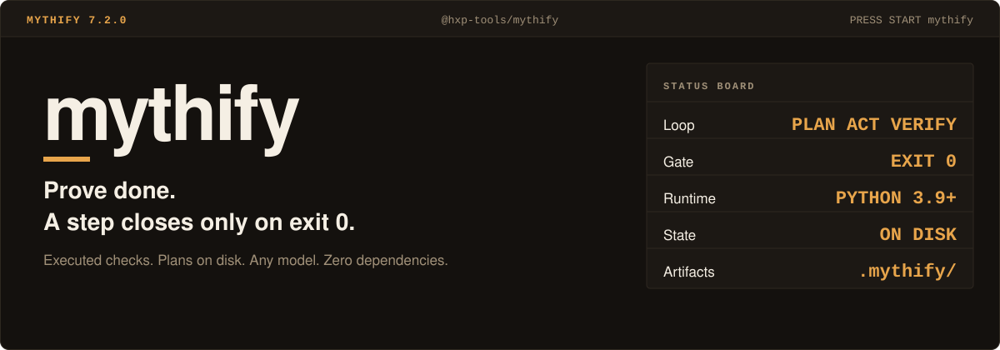
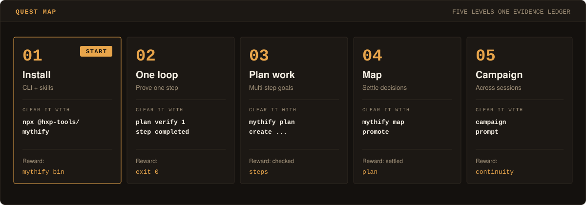
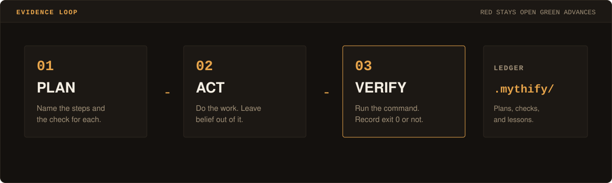

<p align="center">
  
</p>

<p align="center">
  <a href="https://github.com/hannsxpeter/mythify/actions/workflows/ci.yml"></a>
  <a href="https://www.npmjs.com/package/@hxp-tools/mythify"></a>
  <a href="CHANGELOG.md"></a>
  <a href="skills/mythify/SKILL.md"></a>
  <a href="LICENSE"></a>
</p>

<h3 align="center">Prove done.</h3>

<p align="center"><em>Your agent says the tests pass. Mythify makes it run them.</em></p>

Mythify is evidence for AI coding agents. A step closes only after a real
command exits 0. Plans, checks, and lessons live in `.mythify/` on disk, so the
next session opens where this one stopped. Sibling of
[godpowers](https://github.com/hannsxpeter/godpowers),
[godplans](https://github.com/hannsxpeter/godplans), and
[godaudits](https://github.com/hannsxpeter/godaudits). Part of
[`@hxp-tools`](https://www.npmjs.com/org/hxp-tools).

---

## Press start

```bash
npx @hxp-tools/mythify@latest --project .
# or from source:
git clone https://github.com/hannsxpeter/mythify.git
cd mythify
./scripts/install_user.sh --project /path/to/your/project
```

Needs Python 3.9+. Nothing else. The installer puts `mythify`, `mythify-mcp`,
and `mythify-uninstall` in `~/.local/bin` and copies chat skills into the
agent folders it finds.

Then clear the first level:

```bash
mythify plan create "Fix the failing parser test" \
  --steps '[{"title":"Reproduce and fix","success_criteria":"parser tests pass","verify_command":"python3 -m unittest discover -s tests"}]'
mythify step 1 in_progress
# ... do the work ...
mythify plan verify 1
mythify step 1 completed "verify run exit 0: parser tests pass"
```

The last line succeeds only because a real check passed first. Invoke the
installed skills the way your host runs skills, or run `mythify status` from
a shell. Copy `AGENTS.md` into your project root so the agent reads the
protocol. Host-specific MCP paths live in [docs/mcp.md](docs/mcp.md).

---

## The quest map

Five levels. Each writes or unlocks state under `.mythify/`.

<p align="center">
  
</p>

| Level | Clear it with | Reward |
|---|---|---|
| 1. Install | `npx @hxp-tools/mythify` | `mythify` on PATH |
| 2. One loop | `plan verify` then `step completed` | a proven step |
| 3. Plan work | `mythify plan create ...` | steps that close on checks |
| 4. Map | `mythify map` then `map promote` | settled decisions |
| 5. Campaign | `campaign prompt` / `advance` | continuity across sessions |

The game layer is a map, not a scoreboard. There are no points or XP. The real
gate is exit 0.

---

## Evidence loop

<p align="center">
  
</p>

**What you get**

| Piece | What it is |
|---|---|
| Plans and steps | Goals that close only on a matching `verify run` |
| Checks and gate | Named project checks; `verify gate` for host hooks |
| Maps | Decisions before plans; human answers stay human |
| Reviews | Findings rounds and blast-radius safety cases |
| Memory | Facts, decisions, and lessons that survive the chat |
| MCP | The same commands as tools via `mythify-mcp` |

---

## Learn more

- [docs/start-here.md](docs/start-here.md): shortest path to a working loop
- [docs/guide.md](docs/guide.md): plans, verification, maps, reviews, memory, routing
- [docs/commands.md](docs/commands.md): every command and flag
- [docs/mcp.md](docs/mcp.md): MCP setup for any host
- [docs/campaigns.md](docs/campaigns.md): continue a plan across sessions
- [docs/trials.md](docs/trials.md): compare a small instruction edit against a baseline
- [docs/architecture.md](docs/architecture.md): state model and runtime
- [CONTRIBUTING.md](CONTRIBUTING.md) and [CHANGELOG.md](CHANGELOG.md)

## License

MIT. See [LICENSE](LICENSE).
